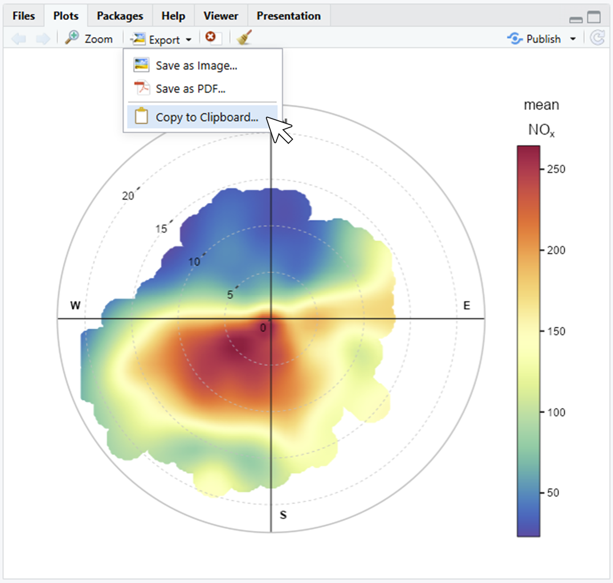

---
format:
  html:
    code-annotations: below
    code-copy: false
---

# The openair package {#openair-package}

In this book two packages are frequently used and it is a good idea to load both.

```{r}
#| message: false
#| warning: false
library(openair)
library(tidyverse)
```

Because the [openair]{.pkg} package (and R itself) are continually updated, it will be useful to know this document was produced using R version `r getRversion()` and [openair]{.pkg} version `r packageDescription("openair", field = "Version")`.

::: callout-note
## Function help

Where code is shown in this document, function names are hyper-linked and will take you to the help page for the function.
:::

## Installation and code access

[openair]{.pkg} is available on [CRAN](https://cran.r-project.org/mirrors.html) (Comprehensive R Archive network) which means it can be installed easily from R. I would recommend re-starting R and then type `install.packages("openair")`. If you use [RStudio](https://rstudio.com/products/rstudio/) (which is *highly* recommended), you can just choose the 'packages' tab on the bottom-right, and then select 'Install'. Simply start typing openair and you will find the package.

For [openair]{.pkg} all development is carried out using Github for version control. Users can access all code used in openair at (<https://github.com/openair-project/openair>).

Sometimes it might be useful to install the development version of [openair]{.pkg} and you can find instructions [here](https://github.com/openair-project/openair).

## Input data requirements

The [openair]{.pkg} package applies certain constraints on input data requirements. **It is important to adhere to these requirements to ensure that data are correctly formatted for use in** [openair]{.pkg}. The principal reason for insisting on specific input data format is that there will be less that can go wrong and it is easier to write code for a more limited set of conditions.

-   Data should be in a data frame (or `tibble`).

-   **The date/time field should be called `date`** --- note the lower case. No other name is acceptable.

-   **The wind speed and wind direction should be named `ws` and `wd`**, respectively (note again, lower case). Wind directions follow the UK Met Office format and are represented as degrees from north e.g. 90 degrees is east. North is taken to be 360 degrees

-   Where fields should have numeric data e.g. concentrations of NO~x~, then the user should ensure that no other characters are present in the column, accept maybe something that represents missing data e.g. 'no data'.

-   Other variables names can be upper/lower case *but should not start with a number*. If column names do have white spaces, R will automatically replace them with a full-stop. While `PM2.5` as a field name is perfectly acceptable, it is a pain to type it in---better just to use `pm25` ([openair]{.pkg} will recognise pollutant names like this and automatically format them as PM~2.5~ in plots).

## Reading and formatting dates and times

While not specific to [openair]{.pkg}, dealing with dates and times is likely to be an issue that needs to be dealt with at some point. There is no getting away from the fact that dates and times can be complicated with issues such as time zones and daylight saving time i.e. when the clocks change for summer. This is a potentially big topic to consider and it is only considered in outline here.

For a lot of [openair]{.pkg} functions this issue will not be important. While these issues can often be ignored, it is better to be explicit and set the date-time correctly. Two situations where it becomes important is when wanting to show temporal variations in local time and combining data sets that are in different time zones. The former issue can be important (for example) when considering diurnal variations in a pollutant concentration that follows a human activity (such as rush-hour traffic), which follows local time and not GMT/UTC.

::: callout-important
## Know your data!

When importing data into R it is important to know how the date-time is represented in your original data, especially in terms of time zone.
:::

When importing data it is important to know how the date-time is represented. In the UK it is easy for us to forget that simply working with data in GMT is not always an option. However, most air quality and meteorological data around the world tends to be in GMT/UTC or a fixed offset from GMT/UTC i.e. not in local time where hours can be missing or duplicated.

Life is made much easier using the [lubridate]{.pkg} package, which has been developed for working with dates and times. The [lubridate]{.pkg} package has a family of functions that will convert common formats of dates and times into a R-formatted version. These functions are useful when importing data and the date-time is in a character format and needs formatting. Here are some examples:

Original date in 'British' format (day/month/ year hours-minutes):

```{r}
library(lubridate) # load package
date_time <- "2/8/2022 11:00"

# format it
dmy_hm(date_time)
```

When R formats a date-time correctly is will be shown from 'large to small' i.e. YYYY-MM-DD HH:MM:SS, which provides a clue that it has indeed been formatted correctly.

US date time with seconds (month-day-year):

```{r}
date_time <- "8/2/2022 11:05:12"
mdy_hms(date_time)
```

As you can see, by default, the date-time is formatted in UTC (GMT). It is at this point where you can also set a time zone of the original data if it was not in GMT. Let's assume the original data were a fixed off-set from GMT of -8 hours (west coast USA perhaps). This can be done by setting the time zone explicitly[^openair-package-1]:

[^openair-package-1]: As R help says: "Contrary to some expectations (but consistent with names such as '⁠PST8PDT⁠'), negative offsets are times ahead of (east of) UTC, positive offsets are times behind (west of) UTC."

```{r}
date_time <- "8/2/2022 11:05:12" # time 8 hours behind GMT
mdy_hms(date_time, tz = "Etc/GMT+8")
```

which actually shows the GMT offset of -8 hours.

A common task might be to plot time series and temporal variations of pollutant concentrations in local time. How does one do this if the imported data are in GMT/UTC (or a fixed offset from GMT/UTC)?

In this case it is necessary to know how the local time zone with daylight saving time (DST) is represented. Time zone names follow the Olson scheme --- you can list them by typing `OlsonNames()`. Given the scenario where we have imported data in GMT but want to display the data in local time (BST --- British Summer Time), we can use the `with_tz` function in [lubridate]{.pkg} to do this:

```{r}
date_time <- "2/8/2022 11:00"

# format it
date_time <- dmy_hm(date_time) # GMT
date_time

# what is the hour?
hour(date_time)

# format in local time
time_local <- with_tz(date_time, tz = "Europe/London")
time_local

# local hour is +1 from GMT
hour(time_local)
```

In the above example, `date_time` and `time_local` are the same absolute time --- we are just changing how the time is displayed. In practice, given a data frame with a `date` column in GMT and there interest in making sure [openair]{.pkg} uses the local time, some formatting such as `mydata$date -> with_tz(mydata$date, tz = "Europe/London")` is what is needed.

Another scenario is you import data using a function such as `read_csv` from the [readr]{.pkg} package and it recognises a date-time in the data and by default assumes it is GMT/UTC. This might be wrong even though it is now formatted correctly in R. In this case you can *force* a new time zone using the `force_tz` function. For example:

```{r}
# a correctly formatted date-time that is in GMT but should be something else
date_time

# force the time zone to be something different
force_tz(date_time, tz = "Etc/GMT+8")
```

Finally, what about combining data sets in different time zones? In @sec-worldmet it is shown how it is possible to access meteorological data from around the world (all in GMT). The interest might be in combining this data with air quality data that is in another time zone. So long as the date-times were correctly formatted in the first place, then simply joining the data sets by date is all that is needed, as R works out how the times match internally. An example of joining two data sets is shown in @sec-link-aq.

## Brief overview of openair {#brief-intr-open}

This section gives a brief overview of the functions in [openair]{.pkg}. Having read some data into a data frame it is then straightforward to run any function. Almost all functions are run as:

```{r}
#| eval: false
functionName(thedata, options, ...)
```

The usage is best illustrated through a specific example, in this case the `polarPlot` function. The details of the function are shown in @sec-polarPlot and through the help pages (type ?polarPlot). As it can be seen there are numerous options associated with `polarPlot` --- and most other functions and each of these has a default. For example, the default pollutant considered in `polarPlot` is `nox`. If the user has a data frame called `theData` then `polarPlot` could minimally be called by:

```{r}
#| eval: false
polarPlot(theData)
```

which would plot a `nox` polar plot if `nox` was available in the data frame `theData`.

Note that the options do not need to be specified in order nor is it always necessary to write the whole word. For example, it is possible to write:

```{r}
#| eval: false
polarPlot(theData, type = "year", poll = "so2")
```

In this case writing `poll` is sufficient to uniquely identify that the option is `pollutant`.

Also there are many common options available in functions that are not explicitly documented. Some common ones are summarised in @tbl-options. For example, `nrow` and `ncol` allow the user to control the layout of multi-panel plots, e.g., `ncol = 4, nrow = 1` would ensure a four-panel plot is 4 columns by 1 row.

```{r}
#| echo: false

tab_dat <- tibble(
  option = c(
    "xlab",
    "ylab",
    "title",
    "subtitle",
    "caption",
    "shape",
    "size",
    "linetype",
    "linewidth",
    "nrow/ncol"
  ),
  description = c(
    "x-axis label",
    "y-axis label",
    "title of the plot",
    "subtitle of the plot",
    "caption of the plot",
    "plotting symbol used for points",
    "size of symbol plotted for points",
    "line type for lines (e.g., solid, dashed, dotted)",
    "line width for lines",
    "the plot layout for multi-panel plots"
  )
)
```

```{r}
#| label: tbl-options
#| tbl-cap: 'Common options used in [openair]{.pkg} plots that can be set by the user but are generally not explicitly documented.'
#| echo: false
knitr::kable(tab_dat, booktabs = TRUE)
```

## The type option

One of the central themes in [openair]{.pkg} is the idea of *conditioning*. Rather than plot $x$ against $y$, considerably more information can usually be gained by considering a third variable, $z$. In this case, $x$ is plotted against $y$ for many different intervals of $z$. This idea can be further extended. For example, a trend of NO~x~ against time can be *conditioned* in many ways: NO~x~ vs. time split by wind sector, day of the week, wind speed, temperature, hour of the day ... and so on. This type of analysis is rarely carried out when analysing air pollution data, in part because it is time consuming to do. However, thanks to the capabilities of R and packages such as [ggplot2]{.pkg}, it becomes easier to work in this way.

In most [openair]{.pkg} functions conditioning is controlled using the `type` option. `type` can be any other variable available in a data frame (numeric, character or factor). A simple example of `type` would be a variable representing a 'before' and 'after' situation, say a variable called `period` i.e. the option `type = "period"` is supplied. In this case a plot or analysis would be separately shown for 'before' and 'after'. When `type` is a numeric variable then the data will be split into four *quantiles* and labelled accordingly. Note however the user can set the quantile intervals to other values using the option `n.levels`. For example, the user could choose to plot a variable by different levels of temperature. If `n.levels = 3` then the data could be split by 'low', 'medium' and 'high' temperatures, and so on. Some variables are treated in a special way. For example if `type = "wd"` then the data are split into 8 wind sectors (N, NE, E, ...) and plots are organised by points of the compass.

There are a series of pre-defined values that `type` can take related to the temporal components of the data as summarised in @tbl-openairType. To use these there *must* be a `date` field so that it can be calculated. These pre-defined values of `type` are shown below are both useful and convenient. Given a data frame containing several years of data it is easy to analyse the data e.g. plot it, by year by supplying the option `type = "year"`. Other useful and straightforward values are "hour" and "month". When `type = "season"` [openair]{.pkg} will split the data by the four seasons (winter = Dec/Jan/Feb etc.). Note for southern hemisphere users that the option `hemisphere = "southern"` can be given. When `type = "daylight"` is used the data are split between nighttime and daylight hours. In this case the user can also supply the options `latitude` and `longitude` for their location (the default is London).

```{r}
#| echo: false

tab_type <- tibble(
  option = c(
    "'year'",
    "'month'",
    "'week'",
    "'monthyear'",
    "'season'",
    "'weekday'",
    "'weekend'",
    "'daylight'",
    "'dst'",
    "'wd'",
    "'seasonyear'"
  ),
  description = c(
    "splits data by year",
    "splits data by month of the year",
    "splits data by week of the year",
    "splits data by year *and* month",
    "splits data by season. Note in this case the user can also supply a `hemisphere` option that can be either 'northern' (default) or 'southern'",
    "splits data by day of the week",
    "splits data by Saturday, Sunday, weekday",
    " splits data by nighttime/daytime. Note the user must supply a `longitude` and `latitude`",
    "splits data by daylight saving time and non-daylight saving time",
    "if wind direction (`wd`) is available `type = 'wd'` will split the data into 8 sectors: N, NE, E, SE, S, SW, W, NW",
    " will split the data into year-season intervals, keeping the months of a season together. For example, December 2010 is considered as part of winter 2011 (with January and February 2011). This makes it easier to consider contiguous seasons. In contrast, `type = 'season'` will just split  the data into four seasons regardless of the year."
  )
)
```

```{r}
#| label: tbl-openairType
#| tbl-cap: 'Built-in ways of splitting data in [openair]{.pkg} using the `type` option that is available for most functions.'
#| echo: false
knitr::kable(
  tab_type,
  booktabs = TRUE
)
```

If a categorical variable is present in a data frame e.g. `site` then that variables can be used directly e.g. `type = "site"`.

### Make your own type

In some cases it is useful to categorise numeric variables according to one's own intervals. One example is air quality bands where concentrations might be described as "good", "fair", "bad". For this situation we can use the `cut` function. In the example below, concentrations of NO~2~ are divided into intervals 0-50, 50-100, 100-150 and \>150 using the `breaks` option. Also shown are user-defined labels. Note there is 1 more break than label. There are a couple of things to note here. First, `include.lowest = TRUE` ensures that the lowest value is included in the lowest break (in this case 0). Second, the maximum value (1000) is set to be more than the maximum value in the data to ensure the final break encompasses all the data.

```{r}
mydata$intervals <- cut(
  mydata$no2,
  breaks = c(0, 50, 100, 150, 1000),
  labels = c(
    "Very low",
    "Low",
    "High",
    "Very High"
  ),
  include.lowest = TRUE
)

# look at the data
head(mydata)
```

Then it is possible to use the new `intervals` variable in most [openair]{.pkg} functions e.g. `windRose(mydata, type = "intervals")`.

A special case is splitting data by date. In this scenario there might be interest in a 'before-after' situation e.g. due to an intervention. The [openair]{.pkg} function `splitByDate` should make this easy. Here is an example:

```{r}
#| label: splitbydate
splitByDate(
  mydata,
  dates = "1/1/2003",
  labels = c("before", "after"),
  name = "scenario"
)
```

This code adds a new column `scenario` that is labelled `before` and `after` depending on the date. Note that the `dates` input by the user is in British format (dd/mm/YYYY) and that several dates (and labels) can be provided.

## Controlling font size {#font-size}

All [openair]{.pkg} plot functions have an option `fontsize`. Users can easily vary the size of the font for each plot e.g.

```{r}
#| eval: false
polarPlot(mydata, fontsize = 20)
```

The font size will be reset to the default sizes once the plot is complete. Finer control of individual font sizes is currently not easily possible.

## Using colours {#colours}

Many of the functions described require that colour scales are used; particularly for plots showing surfaces. It is only necessary to consider using other colours if the user does not wish to use the default scheme. The choice of colours does seem to be a vexing issue as well as something that depends on what one is trying to show in the first place. For this reason, the colour schemes used in [openair]{.pkg} are very flexible: if you don't like them, you can change them easily. R itself can handle colours in many sophisticated ways; see for example the `RColorBrewer` package.

Several pre-defined colour schemes are available to make it easy to plot data, managed by the `openColours()` function. The choice of colours can easily be set using the `cols` argument, which can take either a pre-defined scheme name or a vector of user-defined colours (either built-in R colour names like `"yellow"` or hex codes like `"#FFF000"`). A few examples are shown in @fig-colours using `polarPlot()`. 

A full list of built-in palettes can be obtained with `openSchemes()`. More details about colours can be found in @sec-colours, including a full gallery of available colour schemes in [openair]{.pkg}.

```{r}
#| label: fig-colours
#| fig-cap: "Examples of different colour schemes applied to the same plot."
#| fig-subcap:
#| - "Default colours"
#| - "Pre-defined `turbo` colour scheme"
#| - "User-defined colours from yellow to green"
#| - "Pre-defined `mako` colour scheme modified with the `colorOpts()` function"
#| layout-ncol: 2
#| layout-nrow: 2
# use default colours - no need to specify
polarPlot(mydata)

# use pre-defined "turbo" colours
polarPlot(mydata, cols = "turbo")

# define own colours going from yellow to green
polarPlot(mydata, cols = c("yellow", "green"))

# tweak colour palette through `colorOpts()`
polarPlot(mydata, cols = colorOpts("mako", begin = 0.1, end = 0.9, direction = -1))
```

## Automatic text formatting {#quickText}

[openair]{.pkg} tries to automate the process of annotating plots. It can be time-consuming (and tricky) to repetitively type in text to represent μg m^-3^ or PM~10~ (μg m^-3^) etc. in R. For this reason, an attempt is made to automatically detect strings such as `nox` or `NOx` and format them correctly. Where a user needs a y-axis label such as NO~x~ (μg m^-3^) it will only be necessary to type `ylab = "nox (ug/m3)"`. The same is also true for plot titles, subtitles, captions and tags. 

Users can override this option by setting `auto.text` to `FALSE`.

## Multiple plots on a page {#sec-multiple-plots-page}

We often get asked how to combine multiple plots on one page. Recent changes to [openair]{.pkg} makes this a bit easier. As [openair]{.pkg} uses the [ggplot2]{.pkg} for plotting, the [patchwork]{.pkg} extension package makes it easy to combine multiple plots together.

Let's start by creating a few individual plots.

```{r}
#| output: false
plt1 <- timePlot(mydata, "no2", avg.time = "month", key.position = "none")
plt2 <- variationPlot(mydata, "no2", x = "weekday", key.position = "none")
plt3 <- trendLevel(mydata, key.position = "right")
```

Now let's load [patchwork]{.pkg} and add the plots together, providing a bit of customisation using [ggplot2]{.pkg} and [patchwork]{.pkg} itself.

```{r}
#| label: fig-patchwork
#| fig-cap: An assembly of a few plots on one "page".
#| fig-height: 6
library(patchwork)

((plt1$plot / (plt2$plot + plt3$plot)) &
  ggplot2::theme(plot.margin = ggplot2::margin_auto(4))) +
  plot_layout(guides = "collect", heights = c(0.4, 0.6))
```

[patchwork]{.pkg} is very powerful package for arranging plots, and actually powers functions like `timeVariation()` under the hood. Learn more about this package in its own [package documentation](https://patchwork.data-imaginist.com/). More is also written about arranging plots like this in the [customisation appendix](../appendices/appendix-annotate.qmd).

## Saving plots and data

While you'll likely be using [openair]{.pkg} in an environment like [RStudio](https://rstudio.com/products/rstudio/), you'll likely want to get the outputs of your analysis *outside* of RStudio to put into reports, papers, or other deliverables.

For data, this is relatively straightforward. The `write.csv()` function will write out a dataframe to a local file path. The only arguments it really needs is `x` (the dataframe to save) and `file` (the file path to save it to). For example, the below code chunk will load annual statistics for the Marylebone Road monitoring site, and save them to the path `"my1_annual-stats_2022.csv"`. Always try to give files evocative names so you'll know what's in them in future - `"my1_annual-stats_2022.csv"` is better than `"data.csv"`.

```{r}
#| label: demosavecsv
#| eval: false
library(openair)

marylebone <-
  importUKAQ(
    site = "my1",
    year = 2022,
    source = "aurn",
    data_type = "annual",
    to_narrow = TRUE
  )

write.csv(x = marylebone, file = "my1_annual-stats_2022.csv")
```

Plots are slightly more complicated. If you do use RStudio, the simplest way to save an openair plot is to use the plots pane, visualised in @fig-rstudiosave. This menu will allow you to copy your plot to the clipboard, or save it as an image or PDF.

{#fig-rstudiosave}

This may be useful in some scenarios, but using the RStudio GUI is not very reproducible. For sake of example, say you make a new set of plots every week for a weekly report. You may not want to have to repeatedly go into the plots pane, click 'export', set the correct dimensions, and so on every time a new plot needs to be saved. It would be preferable if your script created the plots *and* saved them!

The easiest way to save plots is using `ggplot2::ggsave()`.

```{r}
#| label: demo-saveplot
#| eval: false
library(openair)
library(ggplot2)

# Make a polarPlot. Note that `plot = FALSE` stops it from being printed when
# the object is created, but is optional here
polar <- polarPlot(mydata, "nox", plot = FALSE)

# save to file
ggsave(
  filename = "polarplot_marylebone_nox.png",
  plot = polar$plot,
  width = 6,
  height = 6,
  dpi = 300,
  units = "in"
)
```

The [openairmaps]{.pkg} package can create interactive HTML maps. To save these, you need to use the `htmlwidgets::saveWidget()` function. This is simpler than saving a static plot as you will not have to worry about resolution or dimensions. 

```{r}
#| label: demo-savewidget
#| eval: false
library(openairmaps)

polarmap <- polarMap(polar_data, "nox")

htmlwidgets::saveWidget(widget = polarmap, file = "polarmap_london_nox.html")
```

Another way of sharing analysis produced using [openair]{.pkg} is in [Quarto](https://quarto.org/) (or [Rmarkdown](https://rmarkdown.rstudio.com/)) reports. These well documented on their respective websites.
